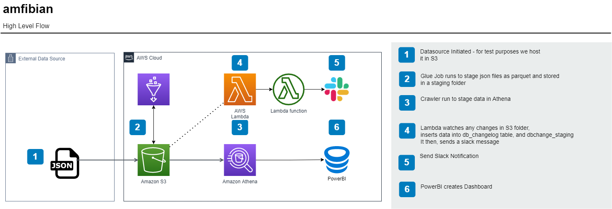

# Amfibian

A Process by which we log and communicate changes in source data and populate downstream data points with those changes 

## Flow

### Diagram

### Description

1. Datasource is pulled and staged as parquet
2. Parquet is crawled and staged in Athena
3. 3 tables created to log change
   - 1 table to log the change and the other that stores the schema as at yesterday
   - Compare datatype, column names, nullability and logged in dbchangelog table
4. Change then written to s3 folder which triggers Lambda ( TODO : Change to EventTrigger)
5. Lambda writes to dbchangelog and trigger another lambda which sends the a slack message to notify business
6. Table that logs change is then dropped.

## Assets

### Athena Tables
- dbchange and dbchange_staging - dbchange.sql
- dbchangelog.sql

### AWS Glue
- glue-stage-json-to-parquet.py

### AWS Lambda
- Config file - playweek-query-athena-mysql.yaml
- Lambda to query athena - query-athena.py
- Lambds to send slack notification - send-slack-notification.py

## TO DO
- Write entire process in Terraform
- Create DAGS for Crawler and Glue Job (Schedule - Once a Day)
- Write downstream to MySQL (optional)
- Parametize Lambda's, Glue Jobs etc
